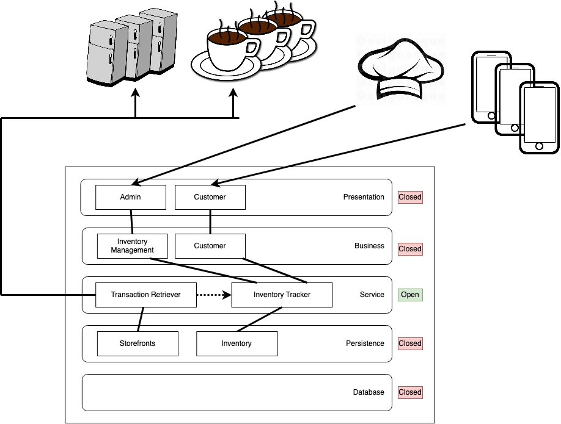

# ADR #1

## Architecture Characteristics

### Primary
* Feasibility - it’s a startup, funds are limited
* Reliability - customer must be able to get food at any time, and inventory must be available
* Usability - need low barrier of use to customers
* Testability - data needs to be right, otherwise poor user experience
* Maintainability - needs to be easy to maintain; probably not going to maintain full time development staff

### Secondary
* Consistency - need inventory list to be accurate
* Auditability - $ trail
* Performance - an aspect of usability; customers should not have to wait a long time to get the necessary information
* Security - handling some customer data (more important when handling health information)
* Evolvability - as the company grows the needs will expand
* Interoperability - POS software and smart fridge choice could change over time
* Extensibility - startup has lots of plans for the future; want to be able to support making meals specific to individual’s health needs

## Decision
We believe that a monolithic/layered architecture will best fulfill the criteria above.

As an early stage startup still validating product market fit, large technical investments (time and money) may reduce agility. Farmacy Foods does not have intense scaling needs and minimizing complexity will help them focus on reaching viability.

# ADR #2

## Presentation Layer
  Because the Farmacy Food employees and customers will be using the application for different purposes, we want distinct presentation components to encapsulate their different user experiences.

## Business Layer
  Farmacy Food employees will be managing inventory including restocking, removing expired products from the system, and analyzing sales. Customers will be browsing the available products. These different action domains warrant different components.

## Service Layer
  * Inventory Tracker is shared by business layer components
  * Separate service (Transaction Retriever) to handle retrieval of transaction information from fridges and kiosks (decouple business logic from vendor-specific APIs)
  * Transaction Retriever synchronously polls (assumption: fridge and kiosk are unable to push transaction events)
  * Transaction Retriever pushes new transactions to Inventory Tracker

## Persistence and Database Layers

Inventory and transactions will need to be stored.

# ADR #3

In discussing which component is persisting transaction data, we identified that the Inventory Tracker should own that responsibility. As the architecture evolves, the transaction and inventory data will need to remain easily accessible to the Inventory Tracker. Furthermore, the Transaction Retriever does not need the data once it has processed it.

The Transaction Retriever may need to store information about the smart fridges and coffee shop kiosks in order to poll for the transaction data.
