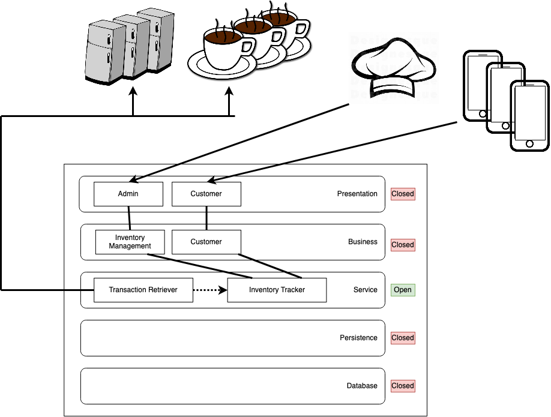

# ADR #2

## Presentation Layer
  Because the Farmacy Food employees and customers will be using the application for different purposes, we want distinct presentation components to encapsulate their different user experiences.

## Business Layer
  Farmacy Food employees will be managing inventory including restocking, removing expired products from the system, and analyzing sales. Customers will be browsing the available products. These different action domains warrant different components.

## Service Layer
  * Inventory Tracker is shared by business layer components
  * Separate service (Transaction Retriever) to handle retrieval of transaction information from fridges and kiosks (decouple business logic from vendor-specific APIs)
  * Transaction Retriever synchronously polls (assumption: fridge and kiosk are unable to push transaction events)
  * Transaction Retriever pushes new transactions to Inventory Tracker

## Persistence and Database Layers

Inventory and transactions will need to be stored.
